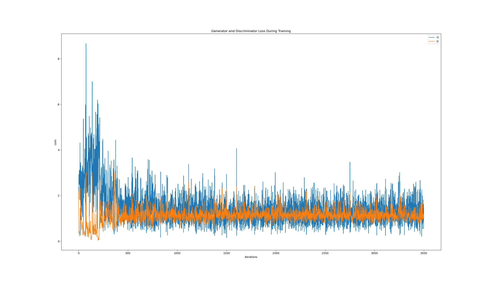
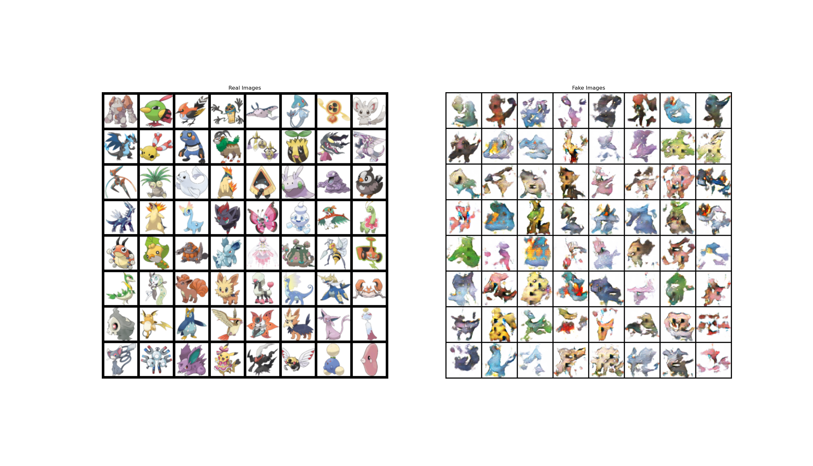

# GANS-pokemon
GAN in PyTorch to generate images of Pokemon

Based on this [Medium article](https://medium.com/@goncalorrc/generating-realistic-pokemons-using-a-dcgan-331c7f75e211) and on this [PyTorch Tutorial](https://pytorch.org/tutorials/beginner/dcgan_faces_tutorial.html).

## Setup

1. Download [dataset](https://www.kaggle.com/datasets/kvpratama/pokemon-images-dataset) from Kaggle
2. Create folder `pokemon_images` in the root dir of this repo
3. Unzip dataset and move folder `pokemon_jpg` under `pokemon_images`
Folder structure for the dataset should look something like:

pokemon_images/\
&emsp;└── pokemon_jpg/\
&emsp;&emsp;├── 1.jpg\
&emsp;&emsp;├── 2.jpg\
&emsp;&emsp;├── ...

4. Edit the hyperparameters stored under `hyps.json` (!!! do not change `image_size` or everything breaks, see [open issue](https://github.com/DontSlipOnDirt/GANS-pokemon/issues/3))
5. Run the train.py module
``` shell
python -m train
```

## Hyperparameters
 The `hyps.json` file contains the hyperparamters used to train the GAN model. The parameters stored here are the following:

 * **image_size**: all images are resized to `image_size x image_size`. Use a value of 64 until this [open issue](https://github.com/DontSlipOnDirt/GANS-pokemon/issues/3) is solved.
* **batch_size**
* **data_folder**: root folder where dataset was downloaded. If following the instructions in this README, the value of this parameter should be `pokemon_images/`
* **latent_dim**: size of z latent vector (i.e. size of generator input)
* **workers**: number of workers for dataloader
* **nc**: number of channels in the training images. For color images this is 3.
* **ngf**: size of feature maps in generator
* **ndf**: size of feature maps in discriminator
* **ngpu**: number of GPUs available. Use 0 for CPU mode.
* **num_epochs**: number of training epochs
* **lr**: learning rate for optimizers
* **beta1**: hyperparameter for Adam optimizers

## Results
After training for 500 epochs (took around 15 mins):

_Training loss_



_Real vs. generated Pokemon_



_Visualization of generated images during training process_ <br>

