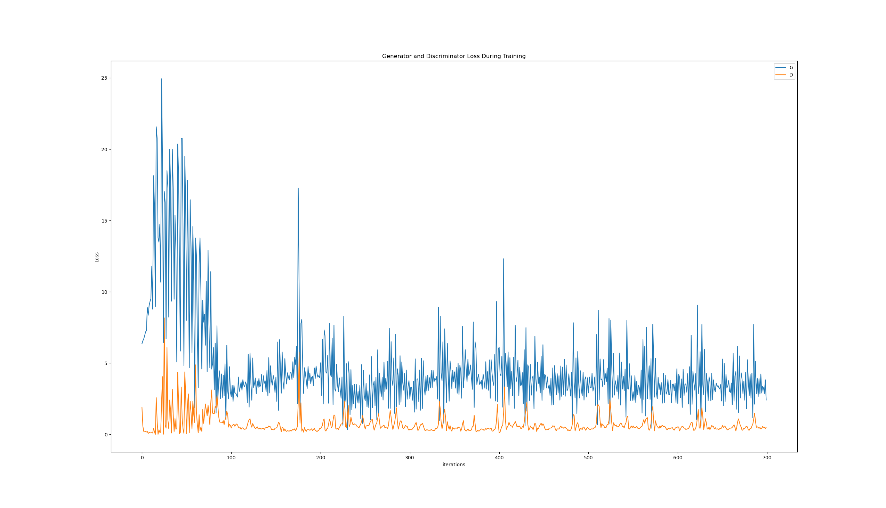
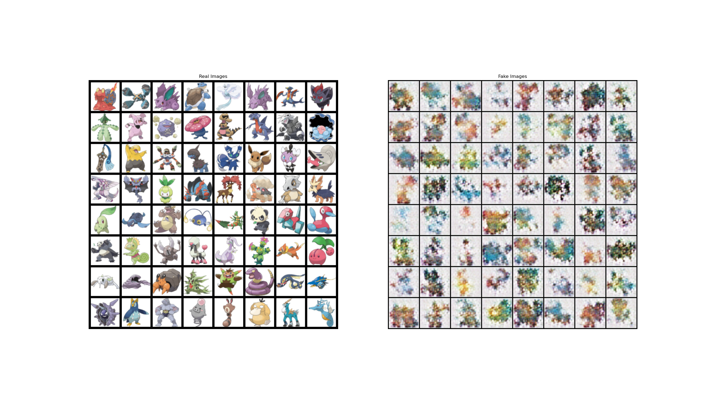

# GANS-pokemon
GAN in PyTorch to generate images of Pokemon

Based on this [Medium article](https://medium.com/@goncalorrc/generating-realistic-pokemons-using-a-dcgan-331c7f75e211) and on this [PyTorch Tutorial](https://pytorch.org/tutorials/beginner/dcgan_faces_tutorial.html).

## Setup

1. Download [dataset](https://www.kaggle.com/datasets/kvpratama/pokemon-images-dataset) from Kaggle
2. Create folder `pokemon_images` in the root dir of this repo
3. Unzip dataset and move folder `pokemon_jpg` under `pokemon_images`
Folder structure for the dataset should look something like:

pokemon_images/\
&emsp;└── pokemon_jpg/\
&emsp;&emsp;├── 1.jpg\
&emsp;&emsp;├── 2.jpg\
&emsp;&emsp;├── ...

4. Edit the hyperparameters stored under `hyps.json` (!!! do not change `image_size` or everything breaks, see [open issue](https://github.com/DontSlipOnDirt/GANS-pokemon/issues/3))
5. Run the train.py module
``` shell
python -m train
```

## Results
After training for 100 epochs (took around 3 mins):

_Training loss_



_Real vs. generated Pokemon_

